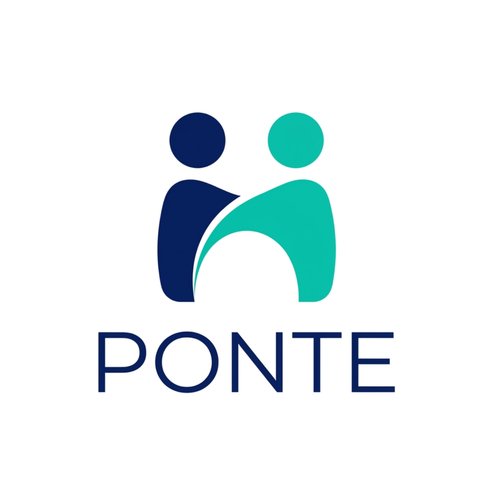
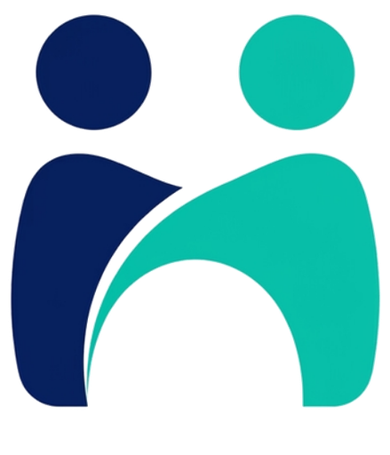

<p align="center">
  
</p>

<h1 align="center">Ponte</h1>

<p align="center">
  <strong>Comunicação Alternativa e Aumentativa (CAA) para crianças autistas não-verbais</strong>
</p>

<p align="center">
  
  
  
  
</p>

---

## 💬 Por que o Ponte existe

Estima-se que **270 a 330 mil crianças no Brasil** sejam autistas não-verbais ou minimamente verbais. Para elas, uma prancha de comunicação não é um acessório: é a diferença entre conseguir dizer *"estou com dor"*, *"quero água"*, *"te amo"* — ou não conseguir dizer nada.

O Ponte é uma ponte literal entre a criança e o mundo dela: uma prancha de símbolos que fala em voz alta o que a criança toca, funciona offline na sala de aula, e cresce junto com o universo de cada criança. O impacto que buscamos:

- **Dar voz à criança** — cada toque em um símbolo é falado por síntese de voz (TTS), transformando um tablet comum em um comunicador.
- **Reduzir o esforço de quem cuida** — pictogramas personalizados gerados por IA a partir de uma **foto real** do universo da criança (o brinquedo dela, a avó dela, a escola dela), em vez de horas configurando bibliotecas genéricas de imagens.
- **Reduzir a carga motora da criança** — a partir de 2–3 toques, a IA sugere a frase completa mais provável, e um toque a aceita.
- **Dar visibilidade a terapeutas e escolas** — um dashboard diário mostra a evolução comunicativa: quais símbolos a criança usa, quantas frases formou, o que está progredindo.

## 🧠 Restrição inviolável: motor planning

A literatura de CAA mostra que **mudar a posição dos símbolos na grade prejudica o aprendizado motor da criança** — ela memoriza o caminho da mão, não só a imagem. Por isso, no Ponte:

> A grade é **append-only por construção**. Símbolos novos (inclusive os gerados por IA) entram sempre no fim da grade. `gridPosition` não tem setter nem endpoint de reposicionamento. Remoção futura será soft-hide, mantendo a célula reservada.

Isso é requisito de arquitetura, não de UX. Nenhuma feature nova pode violar essa regra.

## ✨ Funcionalidades do MVP

| Funcionalidade | Descrição |
|---|---|
| 🗂️ **Prancha de símbolos** | Grade estável com categorias (comida, sentimentos, pessoas, ações, personalizado), barra de frase e fala por TTS |
| 📷 **Símbolo por foto** | O cuidador fotografa algo do universo da criança → vira pictograma na prancha (stub de IA no MVP) |
| 🔮 **Predição de frase** | 2–3 toques → sugestão da frase mais provável, aceita com um toque |
| 📊 **Dashboard do terapeuta** | Resumo diário de comunicação: símbolos usados, frases faladas, predições aceitas |
| 📴 **Offline-first (PWA)** | Service worker + fila offline de eventos: funciona sem internet e sincroniza depois |
| 🔒 **LGPD by design** | Consentimento do responsável é pré-condição de domínio para registrar uso; minimização de dados (apelido em vez de nome, eventos só com IDs) |

## 🚀 Como rodar

Pré-requisitos: **Java 17+** e **Maven**.

```bash
mvn spring-boot:run
```

Um comando sobe tudo em `http://localhost:8080`:

- **Prancha da criança:** `http://localhost:8080/`
- **Dashboard do terapeuta:** `http://localhost:8080/dashboard.html`

O banco é H2 em memória com seed automático (perfil demo + símbolos padrão por emoji) — não precisa configurar nada para experimentar.

Rodar os testes:

```bash
mvn test
```

## 🔌 API REST (`/api/v1`)

| Endpoint | Função |
|---|---|
| `GET /symbols?childId=` | Símbolos globais + personalizados, ordenados por `gridPosition` |
| `POST /symbols/custom` (multipart) | Foto + label + categoria → pictograma → símbolo no fim da grade |
| `POST /usage-events` | Registra toque/frase/predição aceita — **rejeita sem consentimento ativo** |
| `GET /usage/summary?childId=&date=` | Contagens por símbolo e totais do dia (alimenta o dashboard) |
| `POST /predictions` | Símbolos da barra de frase → frases sugeridas |
| `GET /profiles` | Perfis de criança |
| `POST /profiles/{id}/consent` | Registra consentimento do responsável |
| `POST /profiles/{id}/consent/revoke` | Revoga o consentimento |

## 🏗️ Arquitetura

Monolito **Spring Boot 3** (Java 17, Maven) com PWA vanilla servido de `src/main/resources/static/`. Pacotes por domínio sob `br.com.ponte`:

```
br.com.ponte
├── profile     # perfis de criança
├── consent     # consentimento LGPD (regra nasce no domínio)
├── symbol      # símbolos da prancha (gridPosition append-only)
├── usage       # eventos de uso + resumo diário
├── prediction  # predição de frase (interface + stub)
├── picto       # geração de pictograma (interface + stub)
└── config      # seed, CORS, tratamento de erros, wiring de IA
```

### IA plugável

O MVP roda 100% com stubs — nenhuma chamada externa. As interfaces `PictogramGenerationService` e `SentencePredictionService` são trocadas pelas implementações reais quando as chaves forem configuradas em `application.yml`:

```yaml
ponte:
  ai:
    pictogram:
      api-key: ""   # sem chave → stub (foto recortada em quadrado)
    prediction:
      api-key: ""   # sem chave → stub por templates de categoria
```

## 🗺️ Roadmap

- [x] MVP completo (M1–M5): prancha, eventos offline, símbolo por foto, predição, dashboard, PWA
- [x] Captura real de consentimento LGPD na interface (gate duro antes do piloto com famílias)
- [x] Limite de dimensões de imagem no upload (proteção contra bomba de descompressão)
- [ ] Autenticação e ownership (dashboard e predição)
- [ ] Migração H2 → Postgres
- [ ] IA real de pictogramas e predição (plug das chaves de API)
- [ ] App Android nativo reutilizando o mesmo backend REST

## 📚 Documentação

- Spec do design do MVP: [`docs/superpowers/specs/2026-07-16-ponte-mvp-design.md`](docs/superpowers/specs/2026-07-16-ponte-mvp-design.md)
- Plano de implementação: [`docs/superpowers/plans/2026-07-16-ponte-mvp.md`](docs/superpowers/plans/2026-07-16-ponte-mvp.md)

---

<p align="center">
  <br>
  <em>Ponte — porque toda criança tem algo a dizer.</em>
</p>
